# hyperlist-display - Claude Code answers as HyperList



       

A Claude Code display hook that renders every answer as a
[HyperList](https://isene.org/hyperlist/): a tab-indented hierarchy,
one idea per line, numbered by depth. Written in x86_64 Linux assembly.
No libc, no runtime, pure syscalls. Single static binary, ~50KB.

Part of the **CHasm** (CHange to ASM) suite: [bare](https://github.com/isene/bare) (shell), [show](https://github.com/isene/show) (file viewer), [glass](https://github.com/isene/glass) (terminal), [tile](https://github.com/isene/tile) (window manager), [frame](https://github.com/isene/frame) (display server).

<br clear="left">

## What it does

Claude Code lets a `MessageDisplay` hook rewrite an answer before it is
shown. This hook reads the markdown Claude wrote, maps its structure
(headings, bullets, numbered lists, paragraphs) onto HyperList levels,
and hands back tab-indented text. Display only: the transcript and what
Claude reads on the next turn keep the original markdown.

The hook is mechanical. It maps structure the markdown already carries
and cannot invent one. The other half is a CLAUDE.md directive asking
Claude to write in hierarchy in the first place; the two together give
the effect.

## Why assembly

The hook can fire once per streamed chunk. The Python version cost
52 ms per invocation, nearly all of it interpreter startup. The
assembly version starts in microseconds, so a long answer streaming
in chunks costs nothing you can feel.

The Python version is kept in `reference/` as the behavioural
reference. When the two disagree, the Python one says what was meant.

## Install

```sh
make
```

That produces `hyperlist-display`. Point the hook at it from
`~/.claude/settings.json`. The entry needs the nested `hooks` block:

```json
"MessageDisplay": [
  {
    "hooks": [
      {
        "type": "command",
        "command": "/home/you/.claude/hooks/hyperlist-display-asm",
        "timeout": 10
      }
    ]
  }
]
```

Symlink the built binary to that path, so a later `make` updates the
live hook with no further step:

```sh
ln -sf $PWD/hyperlist-display ~/.claude/hooks/hyperlist-display-asm
```

## Turning it off and on

`/hl` toggles rendering. `/hl off` also tells Claude to stop writing in
hierarchy, so both halves switch together. The state is a flag file,
`~/.claude/hyperlist-display.off`, checked on every invocation, so the
toggle takes effect on the next answer and survives restarts and
context compaction.

Three small files carry that:

| file | role |
|------|------|
| `hyperlist-toggle` | flips, sets or reports the flag |
| `hyperlist-output-state.sh` | a `UserPromptSubmit` hook that repeats "HyperList is off" into context while the flag exists |
| `commands/hl.md` | the `/hl` slash command, which runs the toggle |

Symlink the first two into `~/.claude/hooks/` and the third into
`~/.claude/commands/`, then wire `hyperlist-output-state.sh` as a
`UserPromptSubmit` hook the same way as above.

## How the mapping works

- A heading opens a new top-level item; deeper headings nest under it.
- A bullet or numbered list nests one level under whatever came before.
- A list right after a prose line, with no blank line between, nests
  under that line.
- Paragraphs become one item each.
- Bold and italic survive as ANSI, since the terminal gets plain text,
  not markdown. Sentinel bytes mark them through wrapping and expand at
  the end, so they cost no display columns.
- Anything the hook cannot handle makes it exit 1, and Claude Code shows
  the original text. Every error path is a jump to that exit.

## Failure is safe

Exit 1 anywhere means "show the original". A malformed payload, an
over-long line, a buffer at its cap: all fall back to the markdown
Claude wrote. The worst case is an answer that looks the way it would
without the hook.

## License

Public domain, [Unlicense](LICENSE).
